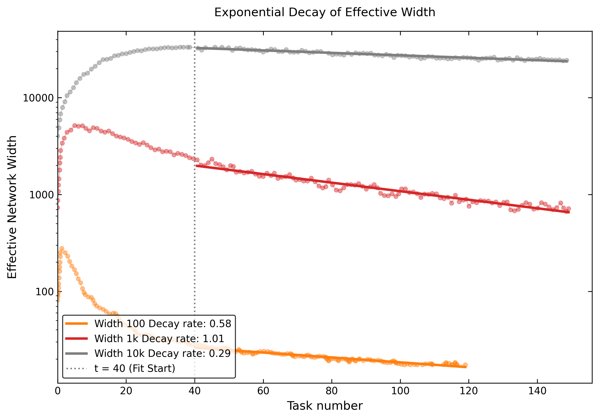

# Continual backpropagation复现

该仓库是北京大学《神经网络的计算基础》一课的大作业内容，复现Loss of plasticity in deep continual learning这篇论文
原论文链接https://www.nature.com/articles/s41586-024-07711-7

loss-of-plasticity文件夹下是基于作者代码的复现结果。

Reproducing and Analyzing Loss of Plasticity in Deep Continual Learning

1. ReproductionWe reproduced the "loss of plasticity" phenomenon from the original paper (source code available in Desktop/mycode). The figure below illustrates the performance degradation on the incremental CIFAR task.

2. Theoretical Analysis: "Effective Width"To quantitatively analyze this phenomenon, we propose Effective Width ($W_{\text{eff}}$) based on Neural Tangent Kernel (NTK) theory. The equivalent width required for a randomly initialized network (trained from scratch) to match the continual learning model's accuracy at a given time step $t$. Formally, let $A_{\text{base}}(W)$ be the converged accuracy of a newly initialized network of width $W$, and $A(t)$ be the continual learning accuracy at step $t$. The Effective Width is defined as:

$$ W_{\text{eff}}(t) = A_{\text{base}}^{-1}(A(t)) $$

3. NTK-Based Exponential DecayBy analyzing $W_{\text{eff}}(t)$, we identified a strict exponential decay trend in the late stage of continual learning ($t > 40$):

$$W_{\text{eff}}(t) \propto e^{-k t}$$

Based on NTK theory, this exponential decay rate $k$ is predicted to be inversely proportional to the square root of the network's physical width $W$:

$$k \propto \frac{1}{\sqrt{W}}$$

(Note: Early-stage dynamics for $t \le 40$ involve complex feature learning, detailed in our full report. Furthermore, due to computational constraints, exhaustively verifying this $\frac{1}{\sqrt{W}}$ scaling law across massively overparameterized networks is left for future work.)
